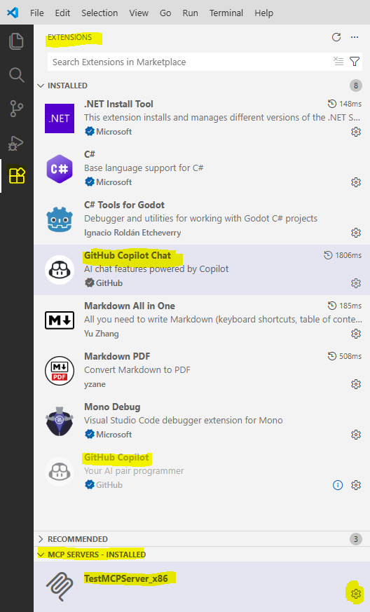
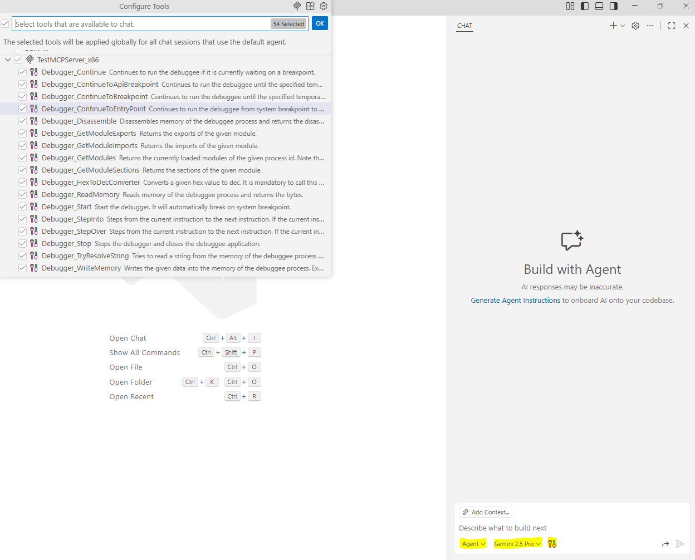

# Fatmike's MCP Debugger

## Introduction

This project is a self-made, lightweight **C++ debugger** developed for learning and experimentation. It implements core debugging functionality from scratch without relying on existing debugger frameworks. For instruction decoding the [Zydis](https://github.com/zyantific/zydis) disassembler is used.

The debugger is integrated with an **MCP server written in C#**, built using the [official MCP C# SDK](https://github.com/modelcontextprotocol/csharp-sdk). The MCP server exposes the debugger functionality as structured tools, enabling external clients to control execution, inspect memory, and analyze the debuggee through a clean interface.

**Keywords**:  
MCP, debugger, disassembler, static analysis, dynamic analysis, debugging, AI, EXE, executable, Windows

## MCP Tools

The MCP server exposes the following tools to interact with the debugger:

### Debugger Lifecycle
- **Debugger_Start**  
  Starts the debugger for the specified executable and breaks on the initial system breakpoint.

- **Debugger_Stop**  
  Stops the debugger and terminates the debuggee process.

### Execution Control
- **Debugger_Continue**  
  Continues execution when the debuggee is stopped at a breakpoint.

- **Debugger_ContinueToEntryPoint**  
  Continues execution from the system breakpoint to the program entry point.

- **Debugger_ContinueToBreakpoint**  
  Continues execution until a temporary breakpoint at a specified virtual address is reached.

- **Debugger_ContinueToApiBreakpoint**  
  Continues execution until a temporary breakpoint on a specified API function is reached.

- **Debugger_StepInto**  
  Steps into the next instruction, entering function calls.

- **Debugger_StepOver**  
  Steps over function calls and continues to the next instruction.

### Code & Memory Inspection
- **Debugger_Disassemble**  
  Disassembles memory at a given virtual address and returns instructions including symbol information.

- **Debugger_TryResolveString**  
  Attempts to resolve and read a string from the debuggee’s memory.

- **Debugger_ReadMemory**  
  Reads raw memory bytes from the debuggee process.

- **Debugger_WriteMemory**  
  Writes arbitrary bytes into the debuggee’s memory.

### Module Inspection
- **Debugger_GetModules**  
  Returns a list of currently loaded modules for the debuggee process.

- **Debugger_GetModuleImports**  
  Returns the imported functions of a specified module.

- **Debugger_GetModuleExports**  
  Returns the exported functions of a specified module.

- **Debugger_GetModuleSections**  
  Returns section information of a specified module.

### Utilities
- **Debugger_HexToDecConverter**  
  Converts hexadecimal values to decimal to avoid number conversion errors.

## Disclaimer

Debugging via MCP can result in **high token usage and increased costs**. AI interactions are stateless, which means that all relevant debugging context (registers, memory, disassembly, modules, etc.) must be transferred repeatedly with each request.

Operations that frequently stop execution and return detailed state—such as stepping and temporary breakpoints—can significantly amplify token consumption.

If **low-cost operation is required**, it is strongly recommended to focus on static analysis and disable the following MCP tools:

- **Debugger_ContinueToBreakpoint**
- **Debugger_ContinueToApiBreakpoint**
- **Debugger_StepInto**
- **Debugger_StepOver**

Disabling these tools reduces the amount of repeated state transfer and helps keep token usage under control.

## Model Recommendations

For complex debugging and reverse-engineering tasks using this MCP debugger, **Claude Opus 4.5** delivered by far the best results as of **November 2025**. It consistently handled large execution traces, detailed disassembly, and multi-step reasoning more reliably than other tested models.

**ChatGPT 4.1** and **Gemini 2.5 Pro** were sufficient for simpler analysis scenarios, such as basic stepping, instruction inspection, and straightforward control-flow reasoning. These models performed well for the examples provided in the `Example_x64` and `Example_x86` folders, but showed limitations when dealing with more complex or long-running debugging sessions.

Model performance may change over time, but the above reflects observed behavior at the time of testing.

## Quickstart: Setting up MCP.Server.exe in VS Code

This guide provides a step-by-step process for building and integrating the **MCP.Server.exe** into Visual Studio Code on **Windows**.

### Step 1: Build the Solution
Before configuring VS Code, you must compile the mcp server:
1. Open `MCPDebugger.sln` in Visual Studio.
2. Build the solution
3. Confirm that `MCP.Server.exe` exists in your `\build\Release\x86` or `\build\Release\x64` subfolder.

### Step 2: Install Required VS Code Extensions
Ensure the following extensions are installed and active in VS Code:
* **GitHub Copilot**
* **GitHub Copilot Chat**

### Step 3: Add the MCP Server
1. Press **`Ctrl` + `Shift` + `P`** to open the Command Palette.
2. Type **`>`** and select **"Add MCP Server"**.
3. Choose **`command` (stdio)** as the server type.

### Step 4: Configure the Path
Enter the full path to `MCP.Server.exe` you built in Step 1.
> [!CAUTION]
> Only **one** architecture (x86 or x64) should be active as MCP server at a time. If you switch architecture, remove the previous server entry first.

| Architecture | Example Path to Enter |
| :--- | :--- |
| **Windows x64** | `C:\YourProject\bin\x64\MCP.Server.exe` |
| **Windows x86** | `C:\YourProject\bin\x86\MCP.Server.exe` |

### Step 5: Finalize & Use
1. **Name the Server:** Enter a name for the MCP Server and press **Enter**.
2. **Verify:** Open **Copilot Chat** (**`Ctrl` + `Alt` + `I`**), switch to **Agent Mode**, and click the **Tools** icon. Your MCP tools should now be listed and ready for use. MCP tools can be enabled / disabled here.

### VS Code Screenshots

#### VS Code: Toolbar with installed extensions and MCP Server

#### VS Code: Copilot Chat Window

## Solution Overview

The Visual Studio solution is organized into the following projects:

- **MCP.Debugger**  
  The core debugger implemented in C++. It includes a C++/CLI bridge to expose a managed interface for .NET clients.

- **MCP.Debugger.Tester**  
  A simple WinForms application used to test the debugger through the managed .NET interface.

- **MCP.Debugger.Types**  
  A types assembly that defines shared structures and data types for managed-native transitions between the debugger and .NET clients.

- **MCP.Server**  
  The C# MCP server that exposes debugger functionality as MCP tools for external clients.

 ## Examples

The repository includes example projects to help get started with static analysis and debugging and are located in the following folders:

- **Example_x64** and **Example_x86**  
  The `Example_x64` and `Example_x86` projects provide a simple console application used as an introductory debugging target. The application prompts the user to enter a password at runtime. The correct password for both examples is *secret*.

- **MCP_Debugging_Sessions**  
  A folder containing more complex debugging sessions that leverage dynamic analysis and debugging. In these sessions **Claude Opus 4.5** was used. The targets can be downloaded [here.](https://crackmes.one/user/Fatmike)  